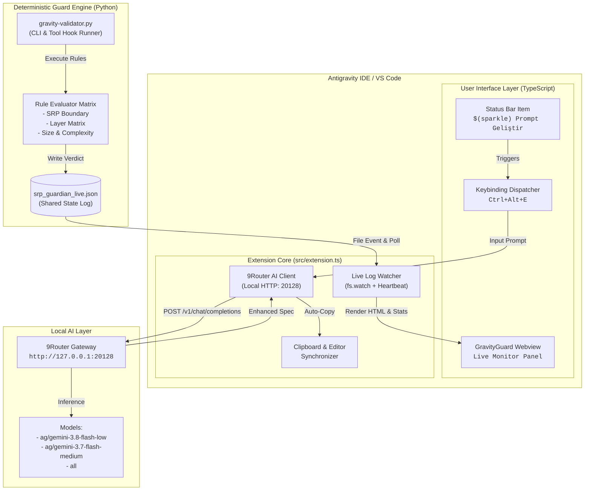

# Architecture & Technical Design — GravityGuard

This document details the architectural topology, component boundaries, execution flows, and engineering decisions behind **GravityGuard**.

---

## 1. System Topology Overview

GravityGuard operates as a dual-layer system combining a native IDE extension with an ultra-lightweight execution guard engine:



---

## 2. Component Responsibility Breakdown

### 2.1. Presentation Layer (TypeScript)
- **`src/extension.ts`**:
  - Acts as the primary lifecycle manager for the VS Code extension host.
  - Registers the Status Bar Item (`vscode.window.createStatusBarItem`) with priority 100 on the right side of the status bar.
  - Registers the `antigravity-guardian-view` webview provider within the dedicated Activity Bar container.
  - Exposes interactive commands:
    - `antigravityBridge.enhancePrompt`: Main prompt enhancement workflow.
    - `antigravityBridge.refreshLogs`: Force-refreshes the log stream.
    - `antigravityBridge.clearLogs`: Purges the local audit log.
    - `antigravityBridge.ping`: Diagnostic healthcheck.

### 2.2. Prompt Engineering Pipeline
The Prompt Enhancer bypasses cloud latency by communicating directly with the user's local **9Router** proxy:
- **Transport**: Node.js native `http.request` targeting `127.0.0.1:20128`.
- **Payload Invariants**: Always enforces `"stream": false` to receive standardized non-streaming JSON.
- **Model Cascade**:
  1. `ag/gemini-3.8-flash-low` (Fastest, ~2-3s average latency)
  2. `ag/gemini-3.7-flash-medium` (Secondary fallback on network error or timeout)
  3. `all` (Automatic router balancing fallback)
- **Output Routing**:
  - The enhanced text is instantly written to the system clipboard via `vscode.env.clipboard.writeText`.
  - If text was selected in the active text editor, it replaces the selection in-place.
  - A non-blocking notification displays an action button: *"Yeni Belgede Aç"* (Open in New Document).

### 2.3. Live Monitor Webview
- Self-contained, zero-dependency HTML/CSS dashboard rendered inside the extension sidebar.
- Styled with modern dark-mode glassmorphism (`#0f172a` slate background, `#1e293b` cards).
- **Resilient Real-time Sync**:
  - Primary: Asynchronous file watcher on `~/.gemini/logs/srp_guardian_live.json`.
  - Secondary: 1.5-second polling interval to guarantee synchronization even on platforms where filesystem watch events are throttled or dropped.
- **Bi-directional Webview IPC**:
  - Webview sends `clearLogs` and `refresh` messages back to the extension host via `vscode.postMessage()`.

### 2.4. Python Guard Engine (`engine/gravity-validator.py`)
- Standalone, highly performant CLI tool written in standard Python (zero external dependencies).
- Evaluates code mutations using lightweight AST inspection and regex pattern matching:
  - **SRP Violation Check**: Scans for the simultaneous presence of UI elements (e.g. PyQt, Tkinter, Blender `bpy.types.Panel`, DOM manipulations) and Network operations (e.g. `urllib`, `requests`, `aiohttp`, `websocket`) within the same file.
  - **File Scale Heuristics**: Distinguishes cohesive single-responsibility files from unmaintainable god-files without arbitrary mechanical line-count blocking.

---

## 3. Data Flow & Lifecycles

### 3.1. Prompt Enhancement Lifecycle
```text
User Action (Click Button or Press Ctrl+Alt+E)
       │
       ▼
Check Active Editor Selection?
   ├── Yes ──> Pre-fill InputBox with selection
   └── No  ──> Open InputBox with placeholder
       │
       ▼
User Submits Input (Enter)
       │
       ▼
Show IDE Progress Notification ("Prompt analiz ediliyor...")
       │
       ▼
POST Request to 9Router (/v1/chat/completions)
   ├── Success (HTTP 200) ──> Parse choices[0].message.content
   └── Failure/Timeout    ──> Retry with Fallback Model
       │
       ▼
Write to System Clipboard (Ctrl+V Ready)
       │
       ▼
Display Success Notification with "Yeni Belgede Aç" Action
```

### 3.2. Guard Gatekeeper Event Lifecycle
```text
AI Agent Tool Call / File Mutation Triggered
       │
       ▼
gravity-validator.py Executes (Target File / Buffer)
       │
       ▼
Evaluate Rule Matrix (< 50ms execution)
   ├── Violation Found ──> Verdict = BLOCKED (Exit code 1)
   └── Clean Code      ──> Verdict = APPROVED (Exit code 0)
       │
       ▼
Append Event to ~/.gemini/logs/srp_guardian_live.json
       │
       ▼
Extension Watcher Detects Change
       │
       ▼
Update Live Monitor Webview & Counter Badges
```

---

## 4. Key Engineering Invariants

1. **Sub-50ms Guard Execution**: The Python guard must never stall an AI agent tool pipeline. Heavy symbol analysis is strictly prohibited.
2. **Deterministic & Offline-First**: Both the guard engine and prompt enhancer function fully offline against local AI models (9Router, Ollama, LM Studio).
3. **Lossless Failure Handling**: If 9Router or the log file is temporarily unavailable, the extension displays friendly notifications without crashing or throwing unhandled promise rejections.
4. **Zero Host File Patching**: No files in the host IDE installation are modified; all integration is handled through officially supported VS Code extension interfaces.
