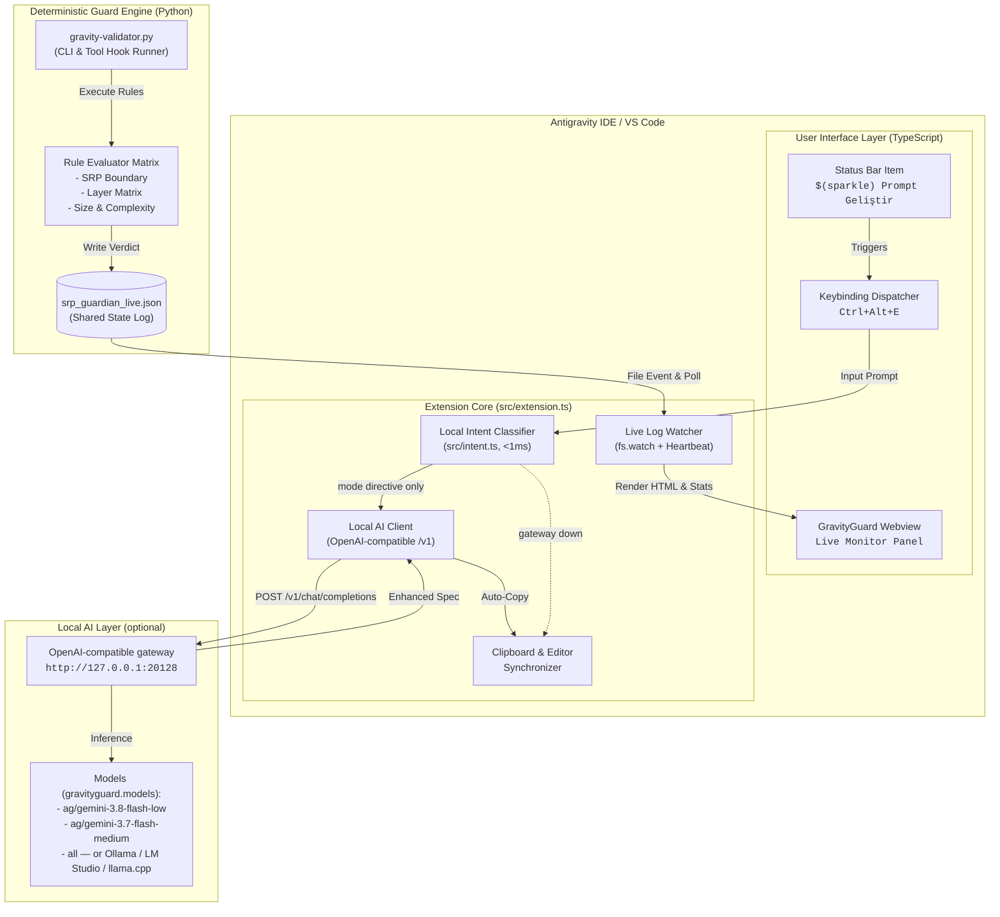

# Architecture & Technical Design — GravityGuard

This document details the architectural topology, component boundaries, execution flows, and engineering decisions behind **GravityGuard**.

---

## 1. System Topology Overview

GravityGuard operates as a dual-layer system combining a native IDE extension with an ultra-lightweight execution guard engine:


```mermaid
flowchart TD
    subgraph Host IDE ["Antigravity IDE / VS Code"]
        direction TB
        subgraph UI ["User Interface Layer (TypeScript)"]
            SB["Status Bar Item<br/><code>$(sparkle) Prompt Geliştir</code>"]
            WV["GravityGuard Webview<br/><code>Live Monitor Panel</code>"]
            KB["Keybinding Dispatcher<br/><code>Ctrl+Alt+E</code>"]
        end

        subgraph CoreExt ["Extension Core (src/extension.ts)"]
            Intent["Local Intent Classifier<br/>(src/intent.ts, &lt;1ms)"]
            RouterClient["Local AI Client<br/>(OpenAI-compatible /v1)"]
            LogWatcher["Live Log Watcher<br/>(fs.watch + Heartbeat)"]
            ClipSync["Clipboard & Editor<br/>Synchronizer"]
        end
    end

    subgraph GuardEngine ["Deterministic Guard Engine (Python)"]
        direction TB
        CLI["gravity-validator.py<br/>(CLI & Tool Hook Runner)"]
        Rules["Rule Evaluator Matrix<br/>- SRP Boundary<br/>- Layer Matrix<br/>- Size & Complexity"]
        LogFile[("srp_guardian_live.json<br/>(Shared State Log)")]
    end

    subgraph LLM ["Local AI Layer (optional)"]
        NineRouter["OpenAI-compatible gateway<br/><code>http://127.0.0.1:20128</code>"]
        Models["Models (gravityguard.models):<br/>- ag/gemini-3.8-flash-low<br/>- ag/gemini-3.7-flash-medium<br/>- all — or Ollama / LM Studio / llama.cpp"]
    end

    %% Interactions
    SB -->|Triggers| KB
    KB -->|Input Prompt| Intent
    Intent -->|mode directive only| RouterClient
    RouterClient -->|POST /v1/chat/completions| NineRouter
    NineRouter -->|Inference| Models
    NineRouter -->|Enhanced Spec| RouterClient
    RouterClient -->|Auto-Copy| ClipSync
    Intent -.->|gateway down| ClipSync

    CLI -->|Execute Rules| Rules
    Rules -->|Write Verdict| LogFile
    LogFile -->|File Event & Poll| LogWatcher
    LogWatcher -->|Render HTML & Stats| WV
```

---

## 2. Component Responsibility Breakdown

### 2.1. Presentation Layer (TypeScript)
- **`src/extension.ts`**:
  - Acts as the primary lifecycle manager for the VS Code extension host.
  - Registers the Status Bar Item (`vscode.window.createStatusBarItem`) with priority 100 on the right side of the status bar.
  - Registers the `antigravity-guardian-view` webview provider within the dedicated Activity Bar container.
  - Exposes interactive commands:
    - `antigravityBridge.enhancePrompt`: Main prompt enhancement workflow.
    - `antigravityBridge.refreshLogs`: Force-refreshes the log stream.
    - `antigravityBridge.clearLogs`: Purges the local audit log.
    - `antigravityBridge.ping`: Diagnostic healthcheck.

### 2.2. Prompt Engineering Pipeline
The Prompt Enhancer talks to **any OpenAI-compatible local gateway** — 9Router, Ollama, LM Studio, llama.cpp — and degrades to a deterministic offline brief when none of them answers.

**Stage 1 — Local intent classification (`src/intent.ts`, no network, <1ms)**
- `classifyIntent()` scores weighted Turkish and English signals and returns `{ mode, confidence, score, runnerUpScore, signals, source }`.
- Three modes, three directives, and **only the selected directive is sent**: `consult` (İSTİŞARE), `implement` (UYGULAMA), `audit` (DENETİM / REFACTOR). The other two never reach the model, so the prompt cannot drift back into "classify the user's intent" and the model cannot silently pick a different mode.
- The user overrides the classifier with a `#denetle:` / `#danış:` / `#kodla:` prefix (`source: 'override'`). A classifier the user cannot contradict is one the user stops trusting.
- Classification moved out of the model because a directive the model is asked to honour is not a decision the repository can test. ROADMAP 2.2 recorded this gap; the classifier plus `tests/intent.test.mjs` closes it.

**Stage 2 — Gateway cascade (optional)**
- **Transport**: Node.js native `http.request` against `gravityguard.routerHost` / `routerPort`, path `/v1/chat/completions`, `"stream": false`.
- **Model cascade** (`gravityguard.models`, env `ROUTER_MODELS`): `ag/gemini-3.8-flash-low` → `ag/gemini-3.7-flash-medium` → `all`. Any OpenAI-compatible model id is valid, so the extension is not coupled to one gateway's naming scheme.
- **Two failure classes, two behaviours.** A *model-level* failure (HTTP error, empty content, timeout) falls through to the next model. A *connection-level* failure (`ECONNREFUSED`, `ENOTFOUND`, `EHOSTUNREACH`, …) means no model behind that host can answer, so the remaining candidates are skipped instead of each burning a full timeout.
- **Per-model timeout**: `gravityguard.routerTimeoutMs`, default 12,000 ms.

**Stage 3 — Offline composer (always available)**
- When no model answers, `buildOfflinePrompt()` renders a structured brief from the classified mode: the original request verbatim, the expected output for that mode, and the standing constraints. The user is told the result came from the offline path.
- This is what makes invariant 2 true for the enhancer rather than aspirational: the feature degrades to a lesser result, never to an error dialog.

**Output routing**
- The enhanced text is written to the system clipboard via `vscode.env.clipboard.writeText`.
- If text was selected in the active text editor, it replaces the selection in-place.
- A non-blocking notification reports the classified mode and whether the offline path produced the result, with an action button: *"Yeni Belgede Aç"*.

### 2.3. Live Monitor Webview
- Self-contained, zero-dependency HTML/CSS dashboard rendered inside the extension sidebar.
- Styled with modern dark-mode glassmorphism (`#0f172a` slate background, `#1e293b` cards).
- **Resilient Real-time Sync**:
  - Primary: Asynchronous file watcher on `~/.gemini/logs/srp_guardian_live.json`.
  - Secondary: 1.5-second polling interval to guarantee synchronization even on platforms where filesystem watch events are throttled or dropped.
- **Bi-directional Webview IPC**:
  - Webview sends `clearLogs` and `refresh` messages back to the extension host via `vscode.postMessage()`.

### 2.4. Python Guard Engine (`engine/gravity-validator.py`)
- Standalone, highly performant CLI tool written in standard Python (zero external dependencies).
- Evaluates code mutations using lightweight AST inspection and regex pattern matching:
  - **SRP Violation Check**: Scans for the simultaneous presence of UI elements (e.g. PyQt, Tkinter, Blender `bpy.types.Panel`, DOM manipulations) and Network operations (e.g. `urllib`, `requests`, `aiohttp`, `websocket`) within the same file.
  - **File Scale Heuristics**: Distinguishes cohesive single-responsibility files from unmaintainable god-files without arbitrary mechanical line-count blocking.
- **Hosts**: Antigravity calls the engine directly (`plugin/hooks.json`). Claude Code goes through `plugin/claude-code/gravityguard_claude_hook.py`, which translates `PreToolUse` (`Write` / `Edit` / `MultiEdit`) and `Stop` events to the engine payload and the answer back (`deny` / `additionalContext` / `{"decision":"block"}`), using the conversation id `claude:<session_id>`. The adapter is not packaged into the VSIX and never copies a rule.
- **Doc policy**: `gravityguard_engine/doc_policy.py` is the single definition of which files owe a CHANGELOG entry; `project_context.is_doc_governed_target` (Stop-time tracker) and `tools/verify_doc_governance.py` (git pre-commit, also callable from another repository's hook) both use it.
- **State scope**: obligations and Stop retries are per conversation (`governance.json` → `sessions[<id>]`); the project-wide lists are a monitor-facing union plus legacy entries nobody owns. See `docs/KNOWLEDGE.md` §2.5.

### 2.6. Specialist Review Subsystem (`review_policy.py`, `review_governance.py`)

Opt-in (`.gravityguard.json` → `review.enabled`), path-based, and split in two so the trigger can be tested without touching state:

- **Trigger — `review_policy.py`.** `should_require_review` fires only for production code suffixes and never for tests (`tests/`, `test_*`, `*.test.ts`, …) or configured `exemptPatterns`. `is_review_enabled` keeps the feature inert until a project asks for it.
- **Obligation & provenance — `review_governance.py`.** A session's governed writes accumulate into one candidate keyed by `review_id`, with `source_fingerprint` = SHA-256 over the sorted newline-normalized file hashes. `register_review_invocation` records the `review_id`/`nonce`/`source_fingerprint` carried by an observed MCP reviewer call. `evaluate_review_obligations` closes an obligation only when an invocation was observed, a schema-valid receipt exists under `.gravityguard/runtime/reviews/`, the fingerprint **and** nonce match, and the candidate is not stale.
- **Two guards.** *Pre-write* (intent): an approved governed write records the obligation. *Final diff guard* (state): at Stop, `record_final_diff_guard` runs `git status --porcelain` and folds in governed code changed out-of-band (e.g. a shell write), best-effort and fail-open.
- **Hook wiring.** `dispatcher.py` observes MCP calls matching `mcp[_-].*code[_-]review` and registers the invocation; `plugin/hooks.json` carries the `"matcher": "mcp_.*code[_-]review"` PreToolUse group.
- **Invariant.** A specialist result cannot authorize integration; GravityGuard verifies process evidence, not semantic correctness. No HMAC (single trust boundary; provenance is correlation). See `docs/adr/0001-specialist-review-v1.md`.

### 2.5. Complexity Heuristics & Their Thresholds (`OE_SPIKE`, `ARCH_FILE_GROWTH`)

Both rules are WARN-only and both are calibrated against 6,404 real production file-writes (11 repositories, last 400 commits each, one file per commit as the unit of work; see the CHANGELOG for the method and its limits). Every number is a default in `DEFAULT_COMPLEXITY_THRESHOLDS` and can be overridden per project through the `complexity` block of `.gravityguard.json`.

| Key | Default | Meaning |
|---|---|---|
| `monolithLoc` | 1000 | File size at which a module is a monolith. Fires on the **crossing** write. |
| `singleWriteLoc` | 180 | One tool call adding this much to an **existing** file. |
| `creepBaseLoc` | 800 | File size above which additions count as creep. |
| `creepAddedLoc` | 80 | Addition that counts as creep on such a file. |
| `overEngineeringMaxLoc` | 50 | "Small change" window for the abstraction spike. |
| `overEngineerAbstractions` | 2 | Declarations inside that window that trip it. |

Two properties matter more than the numbers:

1. **ARCH_FILE_GROWTH measures growth, not state.** A monolithic file is reported on the write that made it a monolith, and afterwards only when it grows materially. Measured justification: 60 writes land on files already past 1,000 lines and only 30 of them carry a material addition, so the previous state check repeated itself on half its fires.
2. **Creation is not accumulation.** The two growth rules skip files that do not exist yet: 359 of 1,636 real file creations added 180+ lines, and a new cohesive module is the outcome the rules ask for. The crossing rule still applies, so a file born over `monolithLoc` is reported.

`srp: allow-monolith` (and the rest of the marker vocabulary the SRP boundary rule already honours) silences the two growth rules. It deliberately does not silence the crossing rule: the marker means "this file is intentionally one unit", so incremental growth is not news — but the write that creates a monolith still is.

---

## 3. Data Flow & Lifecycles

### 3.1. Prompt Enhancement Lifecycle
```text
User Action (Click Button or Press Ctrl+Alt+E)
       │
       ▼
Check Active Editor Selection?
   ├── Yes ──> Pre-fill InputBox with selection
   └── No  ──> Open InputBox with placeholder
       │
       ▼
User Submits Input (Enter)
       │
       ▼
classifyIntent()  (local, <1ms, no network)
   ├── "#denetle:" / "#danış:" / "#kodla:" ──> override wins
   └── else weighted TR+EN signal score ──> consult | implement | audit
       │
       ▼
Show IDE Progress Notification ("<MODE> modunda prompt hazırlanıyor...")
       │
       ▼
buildSystemPrompt(mode) ──> only that mode's directive is sent
       │
       ▼
POST /v1/chat/completions to the local gateway (model cascade)
   ├── HTTP 200 ─────────────> choices[0].message.content
   ├── model-level failure ──> next model in the cascade
   ├── connection failure ───> abort the cascade (no model can answer)
   └── cascade exhausted ────> buildOfflinePrompt() deterministic brief
       │
       ▼
Write to System Clipboard (Ctrl+V Ready)
       │
       ▼
Display Success Notification (mode + offline/LLM origin) with "Yeni Belgede Aç"
```

### 3.2. Tiered Guard Gatekeeper & Diagnostics Lifecycle
```text
AI Agent Tool Call Triggered
       │
       ▼
[TIER 1: FAST GUARD (<10ms, In-Memory)]
   ├── Check G0 (Secret Leaks) ─────────────> BLOCK / WARN
   ├── Check G1 (Silent Exceptions) ────────> BLOCK
   ├── Check G2 (Test Silencing & Deletion) ─> BLOCK / WARN
   ├── Check G3 (Compiler Bypass) ──────────> WARN
   ├── Check G4 (Import Matrix) ────────────> BLOCK
   ├── Check OE_SPIKE (Over-Engineering) ───> WARN
   ├── Check ARCH_FILE_GROWTH (Monolith) ───> WARN (growth event, not file state)
   ├── Check SRP Boundaries ────────────────> BLOCK
   ├── Check T1-T3 (Test Evidence) ─────────> WARN
   └── Read diagnostics.json (<0.5ms) ──────> Surface previous Linter findings (WARN)
       │
       ▼
All Blocking Rules Passed?
   ├── No  ──> Output { decision: "deny", reason: "..." } -> Exit 0
   └── Yes ──> Output { decision: "allow", reason?: "[RULE_ID] ..." } -> Exit 0
               (schema: decision | reason | permissionOverrides | overwrite, protojson camelCase)
       │
       ▼
Tool Execution Completes
       │
       ▼
[TIER 2: ASYNC STATIC VALIDATION (Background Runner)]
Changed file triggers engine/async_runner.py in background:
   ├── Python     ──> Ruff check
   ├── TypeScript ──> ESLint check
   └── GDScript   ──> Godot check-only
       │
       ▼
Writes findings to .gravityguard/runtime/diagnostics.json
       │
       ▼
[TIER 3: BATCH COMPILER CHECK (Debounced)]
Tool burst ends (3s idle) ──> tsc --noEmit across project
```

### 3.3. Hook stdout Contract (v1.2.5)

A `PreToolUse` hook response accepts **only** these keys:

| Key | Type | Required |
|---|---|---|
| `decision` | string (`allow` / `deny` / `ask` / `force_ask`) | yes |
| `reason` | string | no |
| `permissionOverrides` | array of strings | no |
| `overwrite` | object (shallow top-level merge into tool args) | no |

Payloads are **protojson-encoded**, and protojson **rejects unknown fields**. Emitting
any other key makes the harness discard the *entire* response, so an intended WARN
becomes a hard tool failure.

- **v1.2.5 fix**: warnings were previously emitted as a `warnings` / `warning_rule_ids`
  array. That silently blocked every write tool whenever a warning fired — the safer the
  guard (WARN rather than DENY), the worse the outcome. Warnings now travel inside
  `reason` formatted as `[RULE_ID] message`, joined with `" ⚠ "`, so rule IDs stay
  machine-readable through their prefix.
- **Regression protection**: `TestHookStdoutContract` asserts the warn path emits no
  schema-invalid key and still delivers its warning, and `run_validator()` in the test
  harness gates every response against the allowed key set. A plain `json.loads` accepts
  any key — which is why the suite stayed green while production writes were blocked.

#### 3.3.1. The One-Channel Decision (settles the "whisper vs warning" ambiguity)

`reason` is the **only** agent-visible text channel in the contract, and a second channel
would mean changing a schema the IDE side validates. So the question the roadmap left open
— *is a pre-tool architectural whisper a warning, or a new mechanism?* — is answered here:

> **A whisper IS a warning.** Any pre-tool advisory text is delivered as a WARN-only rule's
> `[RULE_ID] ...` payload in `reason`.

Consequences, binding on future work:

- A new advisory capability (the architecture-context whisperer) is added as a **WARN rule
  with its own rule id**, not as a side channel. It therefore inherits the same guarantees
  as every other warning: never blocks, phrased as actionable advice, machine-identifiable
  by its id.
- It must **never** be the only carrier of a blocking decision. Anti-Goal 5 applies: an
  advisory the agent can ignore is fine, one that hides a BLOCK is a security hole.
- Every new WARN rule must add a case to `TestHookStdoutContract`, so the id-prefixed
  `reason` format is proven per rule rather than assumed.

### 3.4. Hidden Background Orchestration & Debounce Worker
1. **Fire-and-Forget Trigger (`trigger_background_validation`)**:
   - Executed on `ALLOW` decisions in `engine/gravity-validator.py`.
   - Spawns `async_runner.py` with `CREATE_NO_WINDOW` + `STARTUPINFO(SW_HIDE)` on Windows, or `start_new_session` on POSIX, with all streams sent to `DEVNULL`.
   - `DETACHED_PROCESS` is intentionally **not** used: a detached process owns no console, so every console child it launches (`cmd.exe` via `npx`, `ruff.exe`, `godot.exe`) allocates a fresh **visible** console window. `CREATE_NO_WINDOW` instead grants a hidden console that all descendants inherit.
   - The pre-tool hook exits immediately (`~1ms` spawn overhead); AI tool-call continues with zero wait.
2. **Silent Linter Invocation (`run_hidden`)**:
   - All Tier 2/3 tool invocations (`ruff`, `eslint` via `npx`, `godot`, `tsc` via `npx`) route through a single `run_hidden()` policy so no linter can ever flash a terminal window.
   - On timeout, `_kill_process_tree()` uses `taskkill /F /T` to terminate the whole process tree, preventing orphaned `cmd.exe`/`node.exe` grandchildren from accumulating.
3. **State-Based Debounce Worker (`debounce_state.json`)**:
   - Records `last_edit_time = time.time()`.
   - Spawns a background worker process that sleeps in 3.0s idle intervals.
   - If an AI agent performs 5 edits in 2.5 seconds, the worker continually resets until a full 3.0s quiet window elapses, then fires `tsc --noEmit` once.
   - **Claim-release invariant (v1.2.3)**: every exit path that leaves a state file behind must clear `worker_running` before returning. The `max_lifetime` guard previously exited without doing so, leaving a stale `True` that blocked all future spawns — the safety mechanism locked the feature it protected.
4. **Per-File Lint Coalescing (`run_coalesced_file_lint_worker`)**:
   - Single-file linters (`ruff`, `eslint`, `godot`) use a 300ms quiet window. The first trigger claims the file in `debounce_state.json`; subsequent triggers inside the window only refresh the timestamp. This is **state-based duplicate suppression**, not a formally atomic mutex — concurrent `load → claim → save` sequences are not guarded by a lock.
   - **New-File Grace Period (v1.2.2)**: because GravityGuard is a `PreToolUse` hook, the worker spawns *before* the AI writes the file. After the quiet window, the worker polls for a **bounded 2.0s** grace period. If the file appears it is linted once; if it never appears the claim is released and the worker exits silently. `execute_single_file_lint()` keeps its own existence check as the final safety net.

---

## 4. Key Engineering Invariants

1. **Sub-10ms Fast Guard Execution**: The synchronous pre-tool interceptor must never stall the AI agent. Heavy external CLI tools (linters, compilers, package managers) are strictly forbidden in Tier 1.
2. **Deterministic & Offline-First**: The guard engine needs nothing but the Python standard library. The prompt enhancer classifies intent locally with no network at all, and reaches an OpenAI-compatible local gateway only as an enhancement — when the gateway is absent the command still returns a usable, mode-correct brief. Offline is the floor, not the degraded path.
3. **Lossless Failure Handling**: If 9Router or diagnostic files are temporarily unavailable, the extension displays friendly notifications without crashing or throwing unhandled exceptions.
4. **Zero Host File Patching**: No files in the host IDE installation are modified; all integration is handled through officially supported VS Code extension interfaces.
5. **Architectural Airbag Principle**: GravityGuard acts as a deterministic seatbelt; it prevents secret leaks and silent errors with BLOCK, while guiding architecture and test evidence through informative WARN signals without paralyzing developer velocity.

---

## 5. Architectural Decision Record (ADR-001)

### ADR-001: Pre-Tool Gatekeeper vs. Static Analysis Engine (Why GravityGuard is NOT SonarQube)

- **Status**: Accepted & Invariant
- **Context**: As AI-assisted development ("vibecoding") scales, agents produce code at unprecedented velocity. A common temptation is to evolve GravityGuard into an all-encompassing static code analyzer (detecting code smells, cyclomatic complexity, dead code, duplication, or deep taint analysis) similar to **SonarQube**, **CodeQL**, or **Semgrep**.
- **Decision**: GravityGuard **must never** attempt to become a general-purpose static analysis platform or SonarQube clone. GravityGuard is strictly an **AI-Native Pre-Write Gatekeeper / Airbag**, operating synchronously before files touch the disk. Deep static analysis belongs to asynchronous post-write tooling in the developer's defense-in-depth pipeline.

#### 5.1. The 4-Layer Defense-in-Depth Topology

In modern AI agent workflows, software integrity is maintained across four distinct, non-overlapping defense rings:


```mermaid
flowchart TD
    subgraph Ring1 ["Ring 1: Pre-Write Gatekeeper (GravityGuard)"]
        direction TB
        R1A["PreToolUse Hook (<5ms latency)"]
        R1B["Prevents Secret Leaks (G0)"]
        R1C["Prevents Silent Catch / Fallbacks (G1)"]
        R1D["Prevents Test Deletion / Silencing (G2)"]
        R1E["Enforces Layer Boundaries (G4 / SRP)"]
        R1F["Tracks Stateful Test Evidence (T1 Deferred)"]
    end

    subgraph Ring2 ["Ring 2: Post-Write Fast Compilers & Linters"]
        direction TB
        R2A["tsc --noEmit (Type soundness)"]
        R2B["Ruff / ESLint (Syntax & local idioms)"]
        R2C["Triggered asynchronously via Tier 2/3 Runner"]
        R2D["Results surfaced into next prompt via diagnostics.json"]
    end

    subgraph Ring3 ["Ring 3: Behavioral Proof (Test Runners)"]
        direction TB
        R3A["vitest / pytest (Unit & Integration)"]
        R3B["Proves code actually runs and satisfies contracts"]
        R3C["Resolves pending T1 test evidence in GravityGuard"]
    end

    subgraph Ring4 ["Ring 4: Deep Static Analysis & Governance (CI/CD)"]
        direction TB
        R4A["SonarQube / Semgrep / CodeQL"]
        R4B["Cyclomatic & Cognitive Complexity"]
        R4C["Code Duplication & Cross-file Dataflow Taint"]
        R4D["CVE Vulnerability & Security Hotspots"]
        R4E["Runs asynchronously in minutes, not milliseconds"]
    end

    ToolIntent["AI Agent File Write Intent"] --> Ring1
    Ring1 -->|ALLOW| DiskWrite["File Written to Disk"]
    DiskWrite --> Ring2
    DiskWrite --> Ring3
    DiskWrite -.->|Pull Request / Git Push| Ring4
```

#### 5.2. Boundary & Responsibility Matrix

| Dimension | Ring 1: GravityGuard | Ring 2: Linters / Compilers (`tsc`, `ruff`) | Ring 4: SonarQube / Semgrep |
|---|---|---|---|
| **Execution Point** | **Pre-Write** (Tool invocation interception before disk I/O) | **Post-Write** (After file lands on disk) | **Post-Commit / CI/CD** (Entire repo scan) |
| **Latency Budget** | **< 10ms** (Typical: 0.1ms - 2ms) | **300ms - 5s** (Debounced) | **30s - 15 minutes** |
| **Primary Failure Mode Addressed** | Destructive / deceptive AI agent shortcuts (secret commits, empty catches, deleting tests to pass CI, god-file creep) | Syntax errors, type mismatches, unmet compiler contracts | Architecture decay, technical debt, code smells, CVEs, cognitive complexity |
| **Enforcement Style** | Synchronous Gatekeeping (`ALLOW` / `BLOCK` / `WARN`) | Diagnostic feedback | Quality gates, PR blocks, compliance dashboards |
| **State Tracking** | Ephemeral tool diffs + lightweight session evidence (`test_evidence_state.json`) | None (per-run file analysis) | Full persistent database of historic codebase metrics |

#### 5.3. Why Becoming SonarQube Destroys GravityGuard's Core Value

1. **Latency Budget Annihilation**: SonarQube performs cross-file AST traversal, symbol resolution, and dataflow graph generation. Running this in a synchronous `PreToolUse` hook would introduce 5-30 second latencies on every single file write, causing the developer or AI agent to disable the hook immediately.
2. **Reinventing Decades of Mature Tooling**: SonarQube, Semgrep, and CodeQL represent hundreds of engineer-years of rule development for thousands of language edge cases. Duplicating a lightweight, buggy subset of these in a Python script creates maintenance debt without delivering industrial-grade depth.
3. **Misaligned Purpose**: SonarQube answers: *"Is this entire codebase maintainable, secure, and compliant with enterprise standards over time?"* GravityGuard answers: *"Is the AI agent about to commit an irreversible, sloppy, or hazardous act right this millisecond?"*
4. **The Airbag Principle**: GravityGuard is an airbag, not a full annual vehicle inspection. An airbag must deploy in 5 milliseconds when a crash (secret leak, silent error, test destruction) occurs. It does not inspect whether the car's upholstery matches or if the engine oil has 10% wear.


